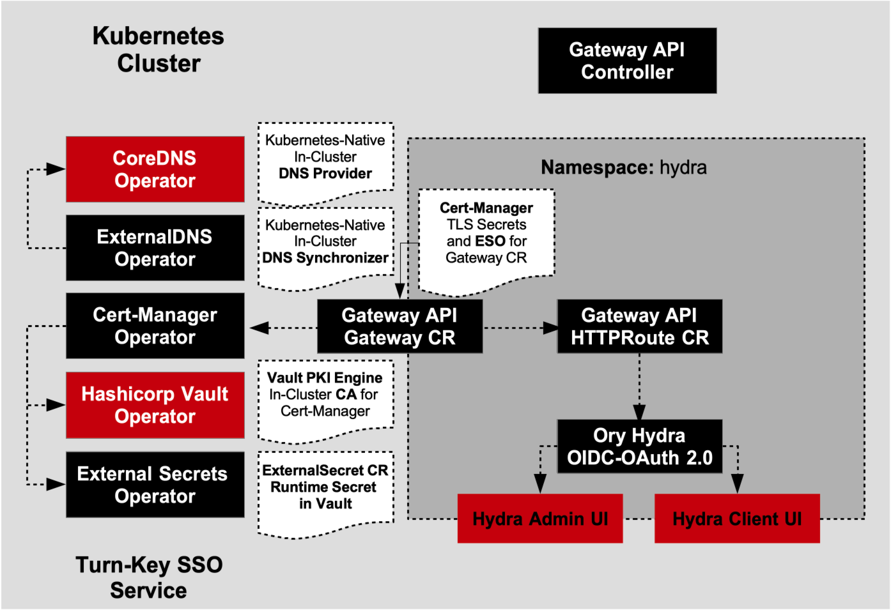

# Kubernetes-Native Turn-Key SSO using Ory Hydra
Kubernetes-Native Turn-Key SSO OIDC OAuth 2.0 using Ory Hydra (SSO OIDC/OAuth 2.0 Engine in Go).

Ory Hydra is a official SSO OIDC-OAuth 2.0 Engine developed in Go and provides Kubernetes Operator to provsion
Kubernetes-Native SSO. This Helm Chart provides coordinating CNCF Kubernetes Operator add-ons to provision Hydra as turn-key SSO for Kubernetes.

- Cert-Manager for TLS Certificate (Secret) Provisoning
- CoreDNS for Kubernetes-Native DNS (DNS Zone) Provisioning
- ExternalDNS for Kubernetes-Native DNS Synchronization w/ CoreDNS Providers to Gateway API Gateways
- External Secrets Operator to provide GitOps Kubernetes Secrets Provisioning
- Hashicorp Vault Operator (PKI Engine) to provide Kubernetes-Native TLS Certificate Authority
to Cert-Manager and to provide Kubernetes Secret Encryption for External Secrets Operator `ExternalSecrets`
- Kubernetes `Gateway API` providing the `Gateway` CR and `HTTPRoute` CR for ingressing TLS traffic to Ory Hydra Admin UI and Ory Hydra Client UI.



## Project Helm Chart

```shell
sso-ory-hydra
    ├── Chart.yaml
    ├── templates
    │   ├── vault-auto-init-job.yaml
    │   ├── vault-auto-unseal-job.yaml
    │   ├── vault-auto-pki.yaml
    │   ├── vault-auto-register-k8s-auth.yaml
    │   ├── vault-init-configmap.yaml
    │   ├── vault-unseal-configmap.yaml
    │   ├── vault-k8s-auth-configmap.yaml
    │   ├── cert-manager-issuer.yaml
    │   ├── external-dns-deployment.yaml
    │   ├── core-dns-config.yaml
    │   ├── nginx-gateway.yaml
    │   ├── client-gateway.yaml
    │   ├── client-route.yaml
    │   ├── external-secrets.yaml
    ├── values.yaml
    └── values-override.yaml
```
